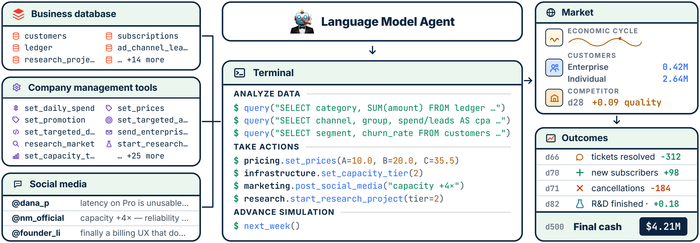

<p align="center">
  
</p>

<h1 align="center">CEO-Bench: Can Agents Play the Long Game?</h1>

<p align="center">
  <a href="https://tonychen.xyz/">Haozhe Chen</a>,
  <a href="https://www.cs.princeton.edu/~karthikn/">Karthik Narasimhan</a>,
  <a href="https://www.cs.princeton.edu/~zhuangl/">Zhuang Liu</a>
</p>

<p align="center">Princeton University</p>

<p align="center">
  <a href="https://ceobench.com">🌐 Website</a> &nbsp;|&nbsp;
  <a href="https://arxiv.org/pdf/2606.18543">📄 Paper</a> &nbsp;|&nbsp;
  <a href="https://ceobench.com/trajectory-viewer/">📊 Trajectory Viewer</a>
</p>


## 📊 Overview

<p align="center">
  
</p>

CEO-Bench evaluates general long-horizon agent capabilities by simulating a
startup over 500 days in a realistic and challenging environment. The agent
operates through a programmable interface with access to business databases,
company management tools, and social media. Outcomes are driven by a partially
observable, noisy, and evolving market with delayed and coupled consequences.


## 🚀 Running CEO-Bench

### 🔑 Setup: Environment variables

CEO-Bench has three LLM roles:

- the benchmarked agent model
- the social/macro post simulator model, Haiku 4.5 by default
- the enterprise customer simulator model, Sonnet 4.5 by default

Pick one provider family and use provider-specific model identifiers in
`src/saas_bench/config.py`.

**Option A: Amazon Bedrock for all models**

```bash
export AWS_ACCESS_KEY_ID="..."
export AWS_SECRET_ACCESS_KEY="..."
export AWS_REGION="us-east-2"
```

```python
agent_llm_provider: str = "bedrock"
agent_llm_model: str = "anthropic.claude-fable-5"  # Claude Fable 5
# or another Bedrock model id, e.g. "us.anthropic.claude-sonnet-4-6"

social_post_llm_provider: str = "bedrock"
social_post_llm_model: str = "us.anthropic.claude-haiku-4-5-20251001-v1:0"

enterprise_llm_provider: str = "bedrock"
enterprise_llm_model: str = "us.anthropic.claude-sonnet-4-5-20250929-v1:0"
```

**Option B: Anthropic direct API for all models**

```bash
export ANTHROPIC_API_KEY="sk-ant-..."
```

```python
agent_llm_provider: str = "anthropic"
agent_llm_model: str = "claude-fable-5"  # Claude Fable 5

social_post_llm_provider: str = "anthropic"
social_post_llm_model: str = "claude-haiku-4-5"

enterprise_llm_provider: str = "anthropic"
enterprise_llm_model: str = "claude-sonnet-4-5"
```

**Option C: OpenRouter for all models**

OpenRouter exposes an OpenAI-compatible endpoint, so the simulator roles use
provider `"openai"` (their calls are routed to `chat/completions` automatically
whenever the client's base URL is not OpenAI's own) and the agent uses the
dedicated `openrouter` provider. Use OpenRouter model identifiers
(`vendor/model`) everywhere.

```bash
export OPENROUTER_API_KEY="sk-or-..."
```

```python
agent_llm_provider: str = "openrouter"
agent_llm_model: str = "anthropic/claude-opus-4.8"  # any OpenRouter model id

social_post_llm_provider: str = "openai"
social_post_llm_model: str = "anthropic/claude-haiku-4.5"

enterprise_llm_provider: str = "openai"
enterprise_llm_model: str = "anthropic/claude-sonnet-4.5"
```

With only `OPENROUTER_API_KEY` set, the simulator's OpenAI-compatible client
automatically points at `https://openrouter.ai/api/v1`. Setting
`OPENAI_API_KEY` / `OPENAI_BASE_URL` explicitly takes precedence. For the
bash agent, `--provider openrouter --model vendor/model` works directly, and
`--base-url` can override the endpoint.

The LLM config fields are:

- `agent_llm_provider`, `agent_llm_model`, `agent_llm_reasoning_effort`
- `social_post_llm_provider`, `social_post_llm_model`
- `enterprise_llm_provider`, `enterprise_llm_model`

The bash-agent CLI `--provider`, `--model`, and `--reasoning-effort` flags only
override the benchmarked agent for ad hoc runs. Simulator social/macro and
enterprise LLMs use the simulator config and do not reuse the agent-only
`--api-key`. If you change a simulator provider, also set the corresponding
model to the identifier expected by that provider; model names are not
translated automatically.

For Claude Fable 5 agent runs, use `--provider anthropic --model claude-fable-5`
for the direct Anthropic API, or `--provider bedrock --model anthropic.claude-fable-5`
for Amazon Bedrock.


### 🎯 Option A: Evaluate any coding agent easily

We built CEO-Bench into a single executable and docs that any coding agent can just download the game and start playing.

The executable is hosted at **[zlab-princeton/run-ceobench](https://github.com/zlab-princeton/run-ceobench)**

If you want to evaluate a coding agent with terminal and internet access, prompt it

```
Download this, read instructions, and finish 500 day gameplay. https://github.com/zlab-princeton/run-ceobench
```


### ⚙️ Option B: Customize the configuration

All tunable simulator constants live in **`src/saas_bench/config.py`**: pricing,
customer groups, ad-channel productivity, R&D speed, competitor difficulty, etc.
After editing, rebuild the public bundle. 

```bash
uv sync                                  # one-time install
uv run python scripts/build_public.py    # rebuild public/ artifact
```

Then generated `public/` directory would play the same role as the same way as **[zlab-princeton/run-ceobench](https://github.com/zlab-princeton/run-ceobench)** in Option A

**Tuning difficulty** You can modify configuration in `config.py` to adjust difficulty.

An important difficulty is competitor strength. Competitor keeps track of a unreleased_dev_bank. Each agent's research and development quality improvement is added to this variable. At each competitor event, competitor draws `u ~ U(competitor_feedback_u_min, competitor_feedback_u_max)`, raises customer expectations by u × unreleased_dev_bank, and subtract this amount from unreleased_dev_bank. Larger competitor_feedback_u_min and competitor_feedback_u_max leads to stronger competitor and higher quality pressure. The default config value is (0.2,0.5). 


### 🤖 Option C: Replicate the bash-agent baseline

The paper's baseline gives an LLM a sandboxed bash shell plus the public CLI and
runs the full 500-day loop with checkpointing and logging. The full process:

**1. Install dependencies** (one-time):

```bash
uv sync
```

**2. Set provider credentials** in a `.env` file at the repo root. Which keys you
need depends on the agent model; for a Bedrock run:

```bash
AWS_ACCESS_KEY_ID="..."
AWS_SECRET_ACCESS_KEY="..."
AWS_REGION="us-east-2"
```

Other providers read `OPENAI_API_KEY`, `ANTHROPIC_API_KEY`, `GOOGLE_API_KEY`,
`XAI_API_KEY`, `TOGETHER_API_KEY`, or `MODAL_TOKEN_*`. No `NMDB_KEY` is needed:
the SQLCipher key is embedded in the engine.

If you configure simulator LLMs to use direct `anthropic` or `openai`, export
`ANTHROPIC_API_KEY` or `OPENAI_API_KEY` in the shell before running. The
simulator does not receive the agent-only `--api-key`.

**3. Run.** `public/` ships prebuilt, so there is no build step:

```bash
uv run python -m saas_bench.agents.bash_agent.run_test \
    --model us.anthropic.claude-sonnet-4-6 \
    --provider bedrock \
    --reasoning-effort max \
    --seed 42 \
    --days 500 \
    --workspace bash_agent_runs
```

**4. Output.** Each run lands at `bash_agent_runs/run_<id>/`: `world.nmdb`
(encrypted ledger), `config.json`, `checkpoint.json`, `agent_workspace/` (the
agent's sandbox, a fresh git repo with weekly commits), and `logs/` containing
per-turn `raw_responses_<id>.jsonl` (model thinking + tool calls),
`tool_results_<id>.jsonl` (tool calls + their outputs), and
`timing_<id>.jsonl`. To score and analyze the run, see
[docs/analyze_trajectory.md](docs/analyze_trajectory.md).

If you edit `src/saas_bench/config.py`, rebuild the bundle the agent sees with
`uv run python scripts/build_public.py` before launching.


### 🧮 Option D (this fork): Claude Code + DeepCell decision-support

This fork adds a harness that plays CEO-Bench with a local **Claude Code** CLI
as the agent and a **[DeepCell](https://deepcell.net)** model as its
forecasting engine and decision log. The agent keeps a dependency-tracked cash
model (`novamind.deepcell`) in a deepcell workspace: driver values are its
forecast beliefs, `EndingCash` is computed by the calc engine, completed weeks
are rolled to ledger actuals, the 95% band lives in `low`/`high` scenarios,
and every weekly decision is recorded as a claim in the model's typed
reasoning graph.

**Prerequisites:** `claude` (Claude Code CLI, authenticated) and `deepcell`
(CLI, logged in to a Jingwei API) on PATH, plus the simulator credentials from
the Setup section (e.g. `OPENROUTER_API_KEY`).

**Pieces** (all in [`deepcell-helpers/`](deepcell-helpers/) +
[`deepcell-instructions.md`](deepcell-instructions.md)):

| Piece | Role |
|---|---|
| `gen_model.py` | Seeds the default cash model (weekly contexts, 10 drivers, `NetCashFlow`/`EndingCash` CalcDefs, `LedgerCash` truth anchor, `low`/`high` scenarios) into the active deepcell workspace. Re-run before every fresh game. |
| `roll_week.py <week>` | Rolls a completed week from forecast to actual: pulls per-category ledger sums from the sim into the model, logs forecast-vs-actual to `forecast_log.csv`, prints the 12-number `next-week` payload (point/low/high at +1/+4/+12/+26 weeks). |
| `advance_week.py <week> '<rationale>'` | **Submit wrapper — forecasts come from the model.** Accepts no numbers: it queries `EndingCash` at +1/+4/+12/+26 weeks (point = base, band = `low`/`high` scenarios) and submits exactly those to `next-week`. The only way to change the forecast is to change the model. |
| `deepcell-instructions.md` | The weekly playbook appended to the agent's generated `CLAUDE.md` via `CEOBENCH_EXTRA_INSTRUCTIONS`. Carries the pre-advance checklist: record a `wk<N>_*` claim + argument edge, bring the model current, advance the assigned week once through the wrapper, end the turn. |

**Launch:**

```bash
uv sync
export OPENROUTER_API_KEY="sk-or-..."            # simulator roles (see Option C above)
export NMDB_KEY=<key from KEYS.md>               # claude_code runner requirement
export DEEPCELL_WORKSPACE=ceo-bench              # dedicated deepcell workspace

python3 deepcell-helpers/gen_model.py --weeks 72          # seed a fresh model

CEOBENCH_EXTRA_INSTRUCTIONS=$PWD/deepcell-instructions.md \
uv run python -m saas_bench.agents.claude_code.run_test \
    --days 500 --seed 42 --workspace claude_code_runs
```

Each run leaves three audit artifacts: the standard `world.nmdb` ledger, the
versioned `novamind.deepcell` (drivers, forecasts, and a claim-per-decision
reasoning graph with `supersedes` edges when the strategy pivots), and
`forecast_log.csv` (forecast-vs-actual calibration per week).

### 🧮 Option E (this fork): Codex CLI + DeepCell decision-support

The same harness can run with a local **Codex CLI** agent. Codex receives the
benchmark and DeepCell playbook through the generated `AGENTS.md`, uses
`./novamind-operation` to play each week, and resumes the same Codex session
until the simulation finishes.

**Prerequisites:** `codex` (authenticated) and `deepcell` (logged in to a
Jingwei API) on PATH, plus the simulator credentials from the Setup section.

```bash
uv sync
export OPENROUTER_API_KEY="sk-or-..."            # simulator roles (see Option C above)
export NMDB_KEY=<key from KEYS.md>               # runner requirement
export DEEPCELL_WORKSPACE=ceo-bench              # dedicated deepcell workspace

python3 deepcell-helpers/gen_model.py --weeks 72 # seed a fresh model

CEOBENCH_EXTRA_INSTRUCTIONS=$PWD/deepcell-instructions.md \
uv run python -m saas_bench.agents.codex_agent.run_test \
    --days 500 --seed 42 --workspace codex_agent_runs \
    --model gpt-5.6-sol --reasoning-effort high
```

Use `--codex-bin /path/to/codex` if the executable is not on PATH. To resume an
interrupted benchmark, pass `--continue-from codex_agent_runs/run_<id>`.


## 📈 Analyzing agent trajectory

Every finished run leaves a single artifact: an encrypted `world.nmdb` ledger
(SQLCipher, page-level AES-256). It is the complete record of the run: cash,
subscriptions, customers, competitor events, and every action the agent took.

The decryption key is fixed and bundled into the published `novamind-operation`
zipapp at build time; see `KEYS.md` in this repo for the value, or import it
from the compiled `saas_bench._embedded_key` module. To decrypt and query:

```bash
KEY=$(grep _NMDB_KEY KEYS.md | head -1 | cut -d'"' -f2)
sqlcipher path/to/world.nmdb \
  "PRAGMA key = '$KEY';" \
  "SELECT day, category, amount FROM ledger ORDER BY day, id LIMIT 10;"
```

For the database schema, analysis recipes, and notes on keeping the agent from
cheating, see **[docs/analyze_trajectory.md](docs/analyze_trajectory.md)**.


## 📁 Repo layout

```
ceobench-src/
├── README.md                          ← this file
├── docs/
│   └── analyze_trajectory.md          ← decrypt, schema + analysis guide
├── public_sources/                    ← human-written inputs to the public build
│   ├── README.md, requirements.txt
│   └── examples/{autoplay_loop,basic_strategy}.py
├── scripts/
│   ├── build_public.py                ← canonical public-repo builder
│   ├── start_fresh_sonnet_bash.sh     ← bash-agent launcher (Bedrock Sonnet)
│   ├── start_fresh_gpt_bash.sh        ← bash-agent launcher (OpenAI GPT)
│   └── resume_run.sh                  ← resume bash agent from checkpoint
└── src/saas_bench/                    ← simulator + bash agent
    ├── simulation.py, environment.py, shocks.py, event_logger.py
    ├── config.py                      ← all tunable constants
    ├── customer_llm.py, personas.py, enterprise.py
    ├── database.py, db_protection.py
    ├── api_server.py, server_entry.py, tools.py
    ├── novamind_api/, novamind_cli.py, _public_cli.py
    └── agents/bash_agent/             ← canonical baseline harness
```


## 📜 Citation

```bibtex
@misc{chen2026ceobenchagentsplaylong,
  title={CEO-Bench: Can Agents Play the Long Game?},
  author={Haozhe Chen and Karthik Narasimhan and Zhuang Liu},
  year={2026},
  eprint={2606.18543},
  archivePrefix={arXiv},
  primaryClass={cs.AI},
  url={https://arxiv.org/abs/2606.18543},
}
```
